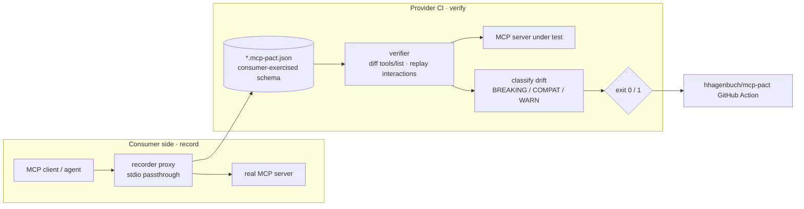

# mcp-pact

[](https://github.com/hhagenbuch/mcp-pact/actions/workflows/ci.yml)
[](https://github.com/hhagenbuch/mcp-pact/actions/workflows/self-test.yml)


> When an MCP server renames a tool, tightens a parameter, or subtly changes
> response shape, nothing fails at deploy time — the agents depending on it
> just quietly get worse. `mcp-pact` brings consumer-driven contract testing
> to MCP: agents record the tool interactions they rely on into a pact file;
> servers verify against those pacts in CI. Breaking changes become a red
> build, not a production mystery.

**Status: MVP.** Record, verify, and a CI action all work today. Design and
schema: [`docs/DESIGN.md`](docs/DESIGN.md), [`docs/SCHEMA.md`](docs/SCHEMA.md).

## Demo

<!-- TODO: replace with a 60-second asciinema/GIF of a `verify` run catching a renamed tool. -->

A provider renames `search_code` → `search`; the consumer's pact catches it and
fails the build:

```console
$ mvn -q -DskipTests package        # builds the shaded jars the launcher runs
$ ./bin/mcp-pact verify support-agent.mcp-pact.json -- npx @you/your-mcp-server
mcp-pact: support-agent → workspace-tools
  ✗ BREAKING search_code (tool.missing): tool used by the pact is not advertised by the server (missing or renamed)
  ── 1 breaking, 0 warn, 0 compat
$ echo $?
1
```

## Architecture



## How it works

1. **Record** — run your MCP client through a transparent stdio proxy; it
   observes `initialize` / `tools/list` / `tools/call` and writes a
   `*.mcp-pact.json` capturing exactly the tools, inputs, and response shapes
   the consumer actually used.
2. **Verify** — in the provider's CI, launch the server and replay the pact:
   diff `tools/list`, replay each interaction, and classify any drift as
   **BREAKING / COMPAT / WARN**. Exit nonzero on BREAKING (`--strict` also fails
   on WARN).

"Pact, for MCP." If you know consumer-driven contracts, you already know this.

## Record (working today)

Put the recorder between your MCP client and the real server; run your agent as
usual, and a pact falls out of the traffic when the client disconnects:

```bash
mvn -q -pl mcp-pact-recorder -am package
./bin/mcp-pact record --out support-agent.mcp-pact.json -- npx some-mcp-server
```

It transparently forwards stdio both ways and captures the **consumer-exercised**
schema — only the fields your agent actually sent, typed from the server's
advertised schema — so the contract encodes your real dependency surface, not
the server's entire API. Response shape is captured with matchers (types, not
brittle literals); tighten with a `regex` where you want a stronger guarantee.

## Verify (working today)

Build the shaded jar and point it at any stdio MCP server:

```bash
mvn -q -pl mcp-pact-verifier -am package
./bin/mcp-pact verify support-agent.mcp-pact.json [--strict] [--json] -- npx some-mcp-server
```

```
mcp-pact: support-agent → example-tools
  ✗ BREAKING search_code (tool.missing): tool used by the pact is not advertised by the server (missing or renamed)
  ── 1 breaking, 0 warn, 0 compat
```

Exit code: `0` = contract holds, `1` = a BREAKING difference (or a WARN under
`--strict`), `2` = usage error — drop it straight into CI.

> **Transport note:** the MVP ships a self-contained stdio JSON-RPC client
> (`StdioMcpConnection`) behind an `McpConnection` interface, so tests are
> hermetic (a real subprocess, zero network). Swapping in the official MCP Java
> SDK is an interface-level change and a roadmap item — the diff/replay logic is
> transport-agnostic.

## In CI (providers): fail the build on breaking changes

Add the action to your MCP server's repo — every PR is now checked against the
consumer contracts it must honor:

```yaml
# .github/workflows/contracts.yml
name: contracts
on: [pull_request]
jobs:
  pacts:
    runs-on: ubuntu-latest
    steps:
      - uses: actions/checkout@v4
      - uses: hhagenbuch/mcp-pact@v1
        with:
          pact: contracts/support-agent.mcp-pact.json
          server-command: npx -y @you/your-mcp-server
          # strict: true   # also fail on WARN (e.g. description drift)
```

This repo dogfoods its own action against `examples/` on every push — see the
**Action self-test** badge above.

## FAQ

Why not just diff the schema? Why is a description change only a WARN? How does
this relate to [Pact](https://pact.io) itself? Does recording capture secrets?
See [`docs/FAQ.md`](docs/FAQ.md).

## Breaking-change taxonomy

| Class        | Examples |
|--------------|----------|
| **BREAKING** | used tool missing/renamed; used input param removed or retyped; new **required** input param; a response matcher fails on replay; capability withdrawn |
| **COMPAT**   | new optional params; new tools; looser input schema; extra response fields |
| **WARN**     | a used tool's **description** changed materially (schema-true but behavior-changing — an MCP-specific hazard) |

The **WARN** tier is the MCP-specific insight: description drift changes model
behavior even when every schema still holds.

## Modules

- **`mcp-pact-core`** — pact model, JSON (de)serialization, schema-diff engine,
  matcher engine. Zero MCP dependency; pure, exhaustively unit-tested logic.
- **`mcp-pact-verifier`** — `./bin/mcp-pact verify pact.json -- <server command>`.
  Launches the server over stdio, diffs + replays, prints the report, sets exit
  code.
- **`mcp-pact-recorder`** — `./bin/mcp-pact record --out consumer.mcp-pact.json -- <server command>`.
  A transparent JSON-RPC passthrough proxy that captures the consumer-exercised
  subset of each schema.
- **`examples/`** — an in-repo MCP server + consumer pact wired into CI as a
  self-test.
- **`action.yml`** — a GitHub Action so any provider adds "verify pacts on every
  PR" in ~5 lines.

## Roadmap

- [ ] Phase 0 — design doc + pact schema (this)
- [x] Phase 1 — `mcp-pact-core`: model + matchers + schema-diff, taxonomy as table-driven tests
- [x] Phase 2 — `mcp-pact-verifier`: stdio client, diff + replay, report, exit codes
- [x] Phase 3 — `mcp-pact-recorder`: passthrough proxy with consumer-exercised schema capture
- [x] Phase 4 — GitHub Action (`action.yml`) + self-test badge + examples
- [ ] Later — HTTP/SSE transport; resources/prompts contracts; a pact broker

## Related

Natural consumer for demos: the MCP client in
[spring-ai-agent-starter](https://github.com/hhagenbuch/spring-ai-agent-starter).
Ties into [agent-operator](https://github.com/hhagenbuch/agent-operator) (a
future `ContractGate` alongside its `EvalGate`).

## License

MIT — see [LICENSE](LICENSE).
